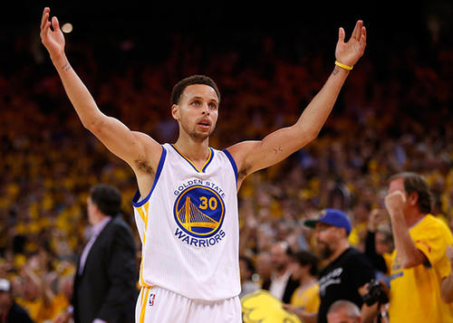
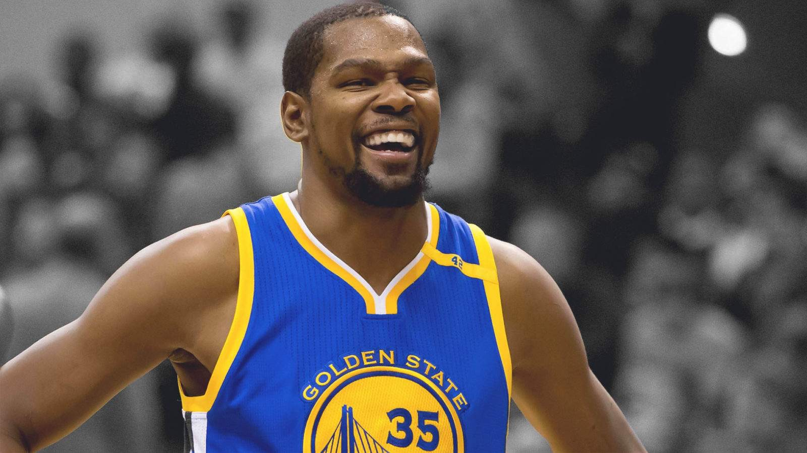
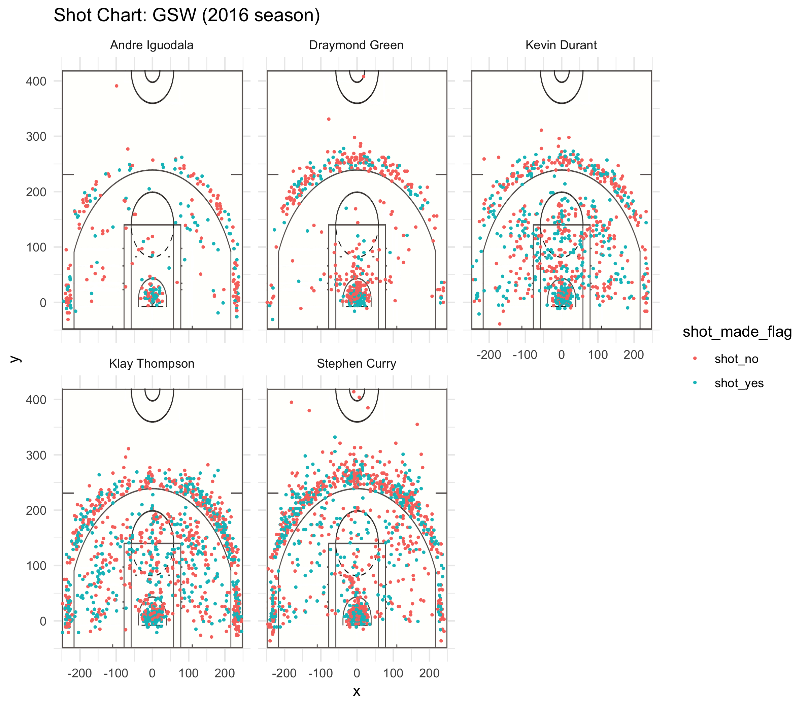

## Analysis of Shooting Statistics of GSW in 2016 Season

**Who is the best at shooting three-point in Season 2016? Whose shooting skills can be taken to the next level? **





In this article, we will closely analyze the shooting statistics of five Golden State Warrior players: Iguodala, Green, Durant, Thompson and Curry. By looking at the effective shooting percentage and the standpoint of their field goal attempts, some conclusions and suggestions will be provided.





```{r include=FALSE}
library(dplyr)
```
***
###Effective Shooting Percentage


First, lets’s look at the 2PT effective shooting percentage by player. Although Andre Iguodala has the highest successful rate, the number of shooting attempts he made is much less than Durant, Curry and Thompson. So it is easier for him to stay in a good shape and have a higher percentage throughout the game. 


```{r echo=FALSE}
#import data set
shots_data<-read.csv("../data/shots-data.csv",stringsAsFactors = FALSE)

twopt<-shots_data[shots_data$shot_type=="2PT Field Goal",]
twopttable<-arrange(
summarise(
  group_by(twopt,name),
  total = sum(shot_type=="2PT Field Goal"),
  made = sum(shot_made_flag=="shot_yes"),
  perc_made = made/total
),
desc(perc_made)
)

knitr::kable(twopttable)
```


Comparing it with the table of 3PT effective shooting percentage displayed below, we can see that Thompson and Curry are definitely two main contributors of scores. Not only do they maintain a high level of successful rate of three-point goals, the number of shooting attempts are significantly larger.  Since it is difficult to keep up the physical strength with the enormous amount of shooting attempts, it is understandable that the overall effective shooting percentage of these two players are relatively lower. 


```{r echo=FALSE}
threept<-shots_data[shots_data$shot_type=="3PT Field Goal",]
threepttable<-arrange(
summarise(
  group_by(threept,name),
  total = sum(shot_type=="3PT Field Goal"),
  made = sum(shot_made_flag=="shot_yes"),
  perc_made = made/total
),
desc(perc_made)
)

knitr::kable(threepttable)
```

The overall effective shooting percentage of the five players is displayed below:


```{r echo=FALSE}

overalltable<-arrange(
summarise(
  group_by(shots_data,name),
  total = sum(season=="2016"),
  made = sum(shot_made_flag=="shot_yes"),
  perc_made = made/total
),
desc(perc_made)
)

knitr::kable(overalltable)
```

It can be seen that Durant is a capable player with huge potential. He has the highest overall effective shooting percentage and a relatively large number of field goal attempts. The number of his 2PT shooting attempts is especially large. However, his 3PT attempts are much less than Curry and Thompson. A really important suggestion for him is to improve his skill in shooting three-point goals and make more attempts of 3PT goals during the game. Iguodala and Green pose smaller threats to opponents compared to Curry, Durant and Thompson. The overall contributions of Iguodala and Green are relatively small, Green especially since his effective shooting percentage is the lowest among the five in all aspects. Therefore, it is important for them to improve their shooting skills.

***

###Standpoint of Field Goal Attempts

The shot chart of the five players displayed below gives us a clear picture of the situations in the games. 

```{r out.width='80%',echo=FALSE,fig.align='center'}

```
It is demonstrated in the charts that Durant, Thompson and Curry pose great threat and are extremely invasive during the games. The shot points are much more denser and Curry obviously shot more three-point goals. Iguodala made most of his field goal attempts right under the basket, costing him less strength. 

Another important thing to note is that players should consciously change the long-distanced two-point attempts to three-point attempts. From the distribution of the standpoints in the shot charts, Thompson should be alert to this strategy. 

***

###Summary 

From what has been discussed above, we can see that Stephen Curry and Klay Thompson definitely pose great threat to opponents. They contribute greatly during the games. In the meantime, Durant is also excellent but needs to work on his three-point skills in order to improve. Draymond and Iguodala needs to raise the number of attempts of shooting and work on their shooting skills.


