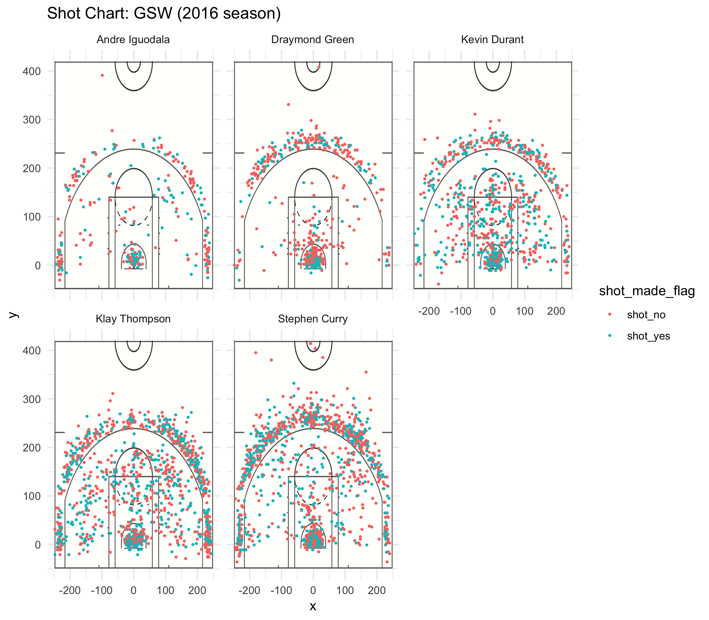

workout01-xinran-song
================
Xinran-Song
2019/3/11

``` r
#import data set
shots_data<-read.csv("../data/shots-data.csv",stringsAsFactors = FALSE)
table(summary(shots_data))
```

    ## 
    ## 1st Qu.: -56.000      1st Qu.: 13.0     1st Qu.: 2.000   
    ##                  1                  1                  1 
    ##    1st Qu.: 2.25      1st Qu.:1.000       1st Qu.:1084   
    ##                  1                  1                  1 
    ##     1st Qu.:11.0      1st Qu.:13.00       1st Qu.:2016   
    ##                  1                  1                  1 
    ## 3rd Qu.:  95.500     3rd Qu.: 8.000      3rd Qu.:198.0   
    ##                  1                  1                  1 
    ##     3rd Qu.:2016      3rd Qu.:25.00      3rd Qu.:3.000   
    ##                  1                  1                  1 
    ##     3rd Qu.:3251       3rd Qu.:33.0      3rd Qu.:43.75   
    ##                  1                  1                  1 
    ## Class :character   Length:4334        Max.   : 246.000   
    ##                  7                  7                  1 
    ##   Max.   :11.000       Max.   :2016      Max.   :4.000   
    ##                  1                  1                  1 
    ##     Max.   :4334       Max.   :48.0      Max.   :59.00   
    ##                  1                  1                  1 
    ##    Max.   :71.00      Max.   :717.0   Mean   :   7.746   
    ##                  1                  1                  1 
    ##   Mean   : 5.412      Mean   :109.4      Mean   :15.58   
    ##                  1                  1                  1 
    ##    Mean   :2.351       Mean   :2016       Mean   :2168   
    ##                  1                  1                  1 
    ##     Mean   :22.8      Mean   :28.60   Median :   1.000   
    ##                  1                  1                  1 
    ##   Median : 5.000      Median : 95.0      Median :19.00   
    ##                  1                  1                  1 
    ##    Median :2.000       Median :2016       Median :2168   
    ##                  1                  1                  1 
    ##     Median :23.0      Median :29.00       Min.   :   1   
    ##                  1                  1                  1 
    ##    Min.   : 0.00     Min.   : 0.000       Min.   : 1.0   
    ##                  2                  1                  1 
    ## Min.   :-248.000      Min.   :-39.0      Min.   :1.000   
    ##                  1                  1                  1 
    ##     Min.   :2016   Mode  :character   
    ##                  1                  7


